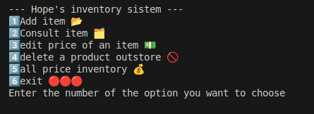
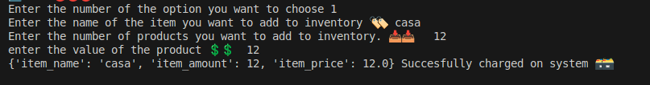
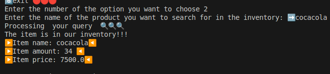
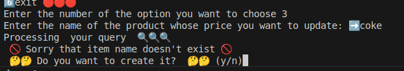
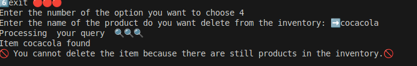
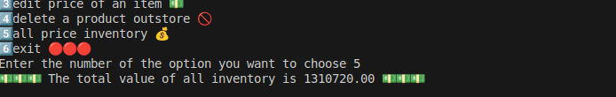

# The Hope's store inventory system

The code contained in this repository is designed to handle the needs of a store.
It is a CRUD system that allows you to manage the products in the "The Hope" store. It is programmed entirely in Python, uses collections such as dictionaries and lists to store information, and has all the functions of a CRUD.
You can create items, delete items, edit items, and calculate the total value of the entire inventory.
It is designed with an elegant and user-friendly interface that is self-explanatory and entertaining.

<h2> How to use the program? </h2>

 1. You can download the code and run it on your machine, or run it in a virtual machine. 
2. Run it. It is important that you run the main command within the file, regardless of the library. 
3. First, you will receive a welcome message and a menu of options. 
4. Choose the action you want to perform. 

 
      -Type 1 if you want to add an item. 
      -Type 2 if you want to view item information. 
      -Type 3 to edit an item's price (you can't add a negative value). 
      -Type 4 to delete entire items. 
      -Type 5 to calculate the price of your entire inventory (to see if you're rich, haha).   </li>

# Usage examples, application screenshots

